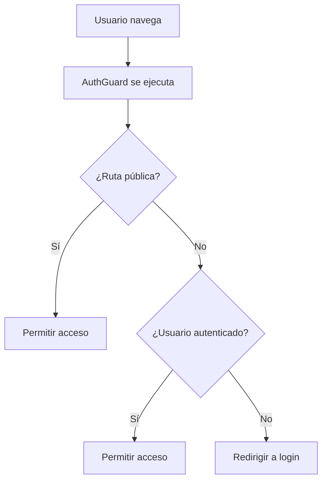

# Implementación del Sistema de Autenticación - Sign-in

## Descripción General

El sistema de autenticación de Tracker Mobility Frontend implementa un flujo de sign-in completo utilizando Vue.js, Pinia para el manejo de estado, y Axios para las peticiones HTTP. El sistema maneja tokens JWT y persiste la sesión del usuario en localStorage.

## Arquitectura del Sistema

### Componentes Principales

1. **Modelos de Datos** (`models/`)
   - `SignInRequest`: Estructura de datos para la petición de login
   - `SignInResponse`: Estructura de datos para la respuesta del servidor

2. **Servicios** (`services/`)
   - `AuthenticationService`: Maneja las llamadas a la API
   - `AuthenticationStore`: Store de Pinia para el manejo de estado
   - `AuthenticationInterceptor`: Interceptor de Axios para agregar tokens
   - `AuthenticationGuard`: Guard de Vue Router para proteger rutas

## Modelos de Datos

### SignInRequest
```javascript
class SignInRequest {
    constructor(username, password) {
        this.username = username;  // Nombre de usuario
        this.password = password;  // Contraseña
    }
}
```

### SignInResponse
```javascript
class SignInResponse {
    constructor(id, username, token, role) {
        this.id = id;              // ID único del usuario
        this.username = username;  // Nombre de usuario
        this.token = token;        // Token JWT de autenticación
        this.role = role;          // Rol del usuario en el sistema
    }
}
```

## Flujo de Autenticación

### 1. Inicialización de la Aplicación
```mermaid
graph TD
    A[Aplicación inicia] --> B[AuthStore.initialize()]
    B --> C{¿Datos en localStorage?}
    C -->|Sí| D[Restaurar sesión]
    C -->|No| E[Usuario no autenticado]
    D --> F[Actualizar estado del store]
    E --> G[Redirigir a login]
    F --> H[Usuario autenticado]
```

### 2. Proceso de Login
```mermaid
graph TD
    A[Usuario envía credenciales] --> B[Crear SignInRequest]
    B --> C[AuthService.signIn()]
    C --> D[HTTP POST /authentication/sign-in]
    D --> E{¿Respuesta exitosa?}
    E -->|Sí| F[Crear SignInResponse]
    E -->|No| G[Mostrar error]
    F --> H[Actualizar Store]
    H --> I[Guardar en localStorage]
    I --> J[Redirigir al dashboard]
    G --> K[Mantener en login]
```

### 3. Protección de Rutas


## Implementación Detallada

### AuthenticationService

**Responsabilidades:**
- Realizar peticiones HTTP de autenticación
- Manejar comunicación con el backend

**Métodos principales:**
- `signIn(signInRequest)`: Envía credenciales al servidor

```javascript
signIn(signInRequest) {
    return http.post("/authentication/sign-in", signInRequest);
}
```

### AuthenticationStore (Pinia)

**Estado:**
```javascript
state: () => ({
    signedIn: false,    // Indica si el usuario está autenticado
    id: 0,              // ID del usuario
    username: '',       // Nombre de usuario
    role: ''            // Rol del usuario
})
```

**Getters:**
- `isSignedIn`: Verifica si el usuario está autenticado
- `currentUserId`: Retorna el ID del usuario actual
- `currentUsername`: Retorna el nombre de usuario actual
- `currentRole`: Retorna el rol del usuario actual
- `currentToken`: Retorna el token desde localStorage

**Acciones principales:**

#### signIn(signInRequest, router)
1. Llama al AuthenticationService
2. Procesa la respuesta del servidor
3. Actualiza el estado del store
4. Guarda datos en localStorage
5. Redirige al dashboard

#### signOut(router)
1. Limpia el estado del store
2. Elimina datos de localStorage
3. Redirige al login

#### initialize()
1. Verifica si existen datos en localStorage
2. Restaura la sesión si los datos son válidos
3. Actualiza el estado del store

### AuthenticationInterceptor

**Propósito:** Agregar automáticamente el token JWT a todas las peticiones HTTP

**Funcionamiento:**
```javascript
export const authenticationInterceptor = (config) => {
    const authenticationStore = useAuthenticationStore();
    const isSignedIn = authenticationStore.isSignedIn;
    
    if (isSignedIn) {
        config.headers.Authorization = `Bearer ${authenticationStore.currentToken}`;
    }
    
    return config;
}
```

### AuthenticationGuard

**Propósito:** Proteger rutas que requieren autenticación

**Lógica:**
1. Verifica si la ruta es pública (`/tracker-mobility/sign-in`)
2. Si no es pública, verifica autenticación
3. Restaura sesión desde localStorage si es necesario
4. Permite o deniega el acceso según el estado

## Configuración y Uso

### 1. Inicialización en main.js
```javascript
import { useAuthenticationStore } from './tracker-mobility/security/services/authentication.store.js';

const app = createApp(App);
const authStore = useAuthenticationStore();
authStore.initialize();
```

### 2. Configuración del Interceptor
```javascript
import axios from 'axios';
import { authenticationInterceptor } from './authentication.interceptor.js';

axios.interceptors.request.use(authenticationInterceptor);
```

### 3. Configuración del Guard
```javascript
import { createRouter } from 'vue-router';
import { authenticationGuard } from './authentication.guard.js';

const router = createRouter({
    // ... configuración de rutas
});

router.beforeEach(authenticationGuard);
```

## Persistencia de Datos

### localStorage
El sistema utiliza localStorage para mantener la sesión entre recargas de página:

```javascript
// Datos guardados
localStorage.setItem('token', signInResponse.token);
localStorage.setItem('userId', signInResponse.id);
localStorage.setItem('username', signInResponse.username);
localStorage.setItem('role', signInResponse.role);

// Restauración de datos
const token = localStorage.getItem('token');
const userId = localStorage.getItem('userId');
const username = localStorage.getItem('username');
const role = localStorage.getItem('role');
```

## Rutas de Navegación

### Rutas Públicas
- `/tracker-mobility/sign-in` - Página de login

### Rutas Protegidas
- `/tracker-mobility/{id}/dashboard` - Dashboard principal
- Todas las demás rutas del sistema

### Redirecciones
- **Login exitoso:** → `/tracker-mobility/{userId}/dashboard`
- **Sin autenticación:** → `/tracker-mobility/sign-in`
- **Logout:** → `/tracker-mobility/sign-in`

## Manejo de Errores

### Errores de Login
```javascript
.catch(error => {
    this.signedIn = false;
    console.log(error);
    router.push({name: 'sign-in'});
});
```

### Validación de Sesión
- Verifica token válido en localStorage
- Restaura automáticamente la sesión si los datos son válidos
- Redirige a login si los datos no son válidos

## Consideraciones de Seguridad

1. **Token JWT:** Se almacena en localStorage y se envía en header Authorization
2. **Interceptor automático:** Agrega el token a todas las peticiones HTTP
3. **Guard de rutas:** Protege el acceso a rutas no autorizadas
4. **Limpieza de sesión:** Elimina todos los datos al cerrar sesión

## Flujo Completo de Ejemplo

```javascript
// 1. Usuario ingresa credenciales
const signInRequest = new SignInRequest('usuario123', 'password123');

// 2. Store procesa el login
await authStore.signIn(signInRequest, router);

// 3. Si es exitoso, se actualiza el estado
// authStore.signedIn = true
// authStore.id = response.data.id
// authStore.username = response.data.username
// authStore.role = response.data.role

// 4. Datos se guardan en localStorage
// localStorage: token, userId, username, role

// 5. Usuario es redirigido al dashboard
// router.push(`/tracker-mobility/${userId}/dashboard`)

// 6. En futuras peticiones HTTP
// Authorization: Bearer {token} (automático)

// 7. En futuras navegaciones
// AuthGuard verifica autenticación (automático)
```

## Notas Importantes

- El sistema **NO** incluye funcionalidad de sign-up (está comentada)
- Solo maneja el flujo de sign-in
- La sesión persiste entre recargas de página
- Todos los tokens se envían automáticamente en las peticiones HTTP
- Las rutas están protegidas automáticamente por el guard